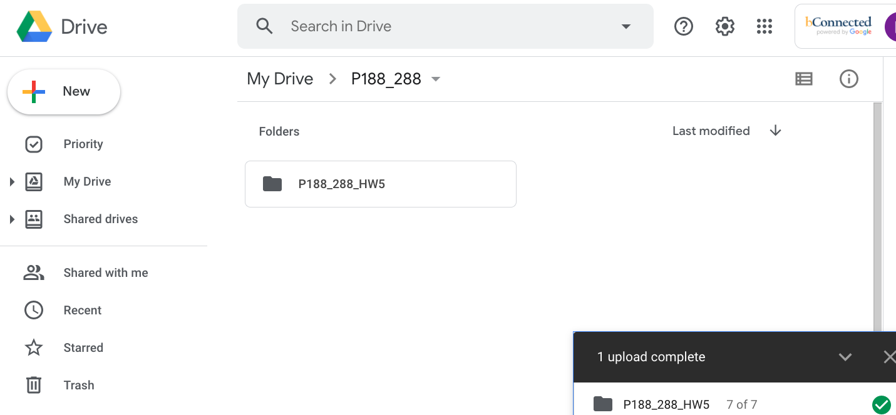
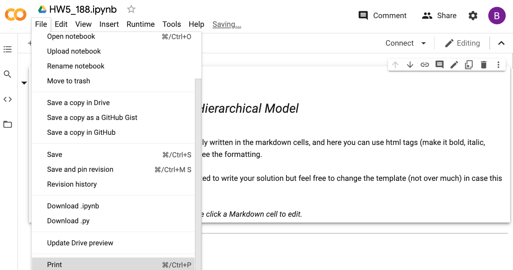
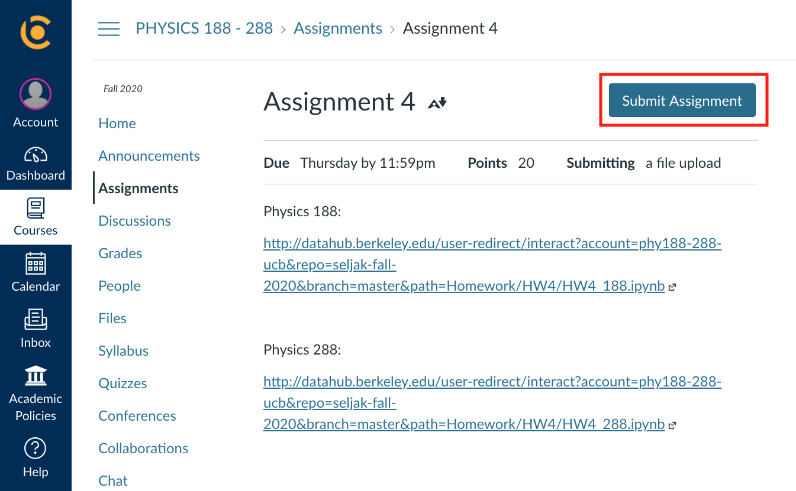
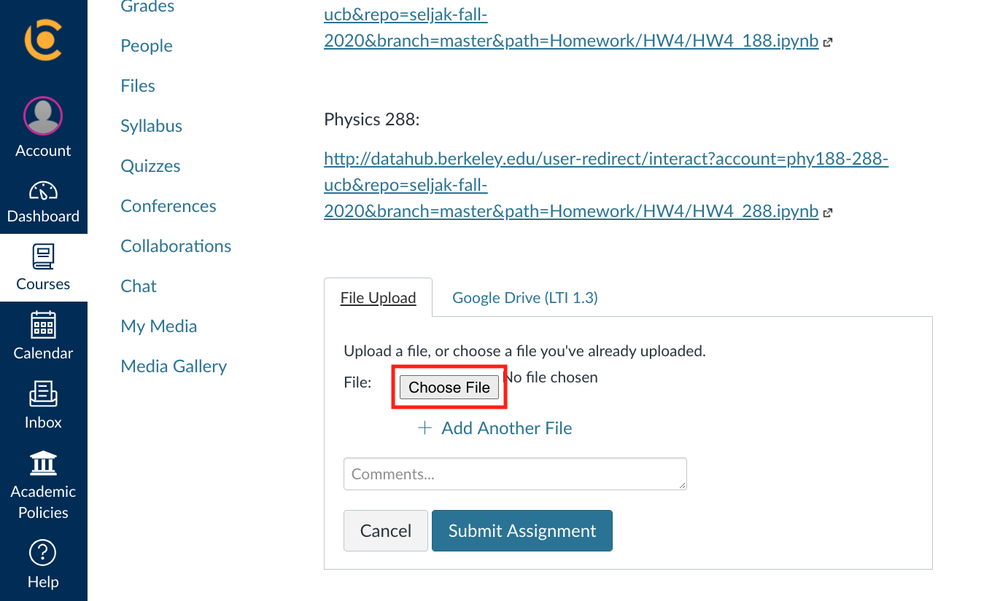
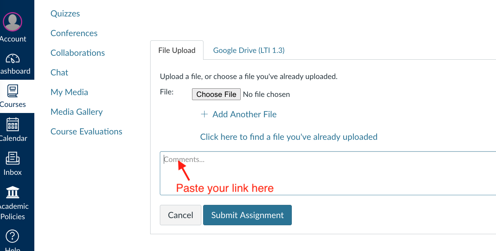
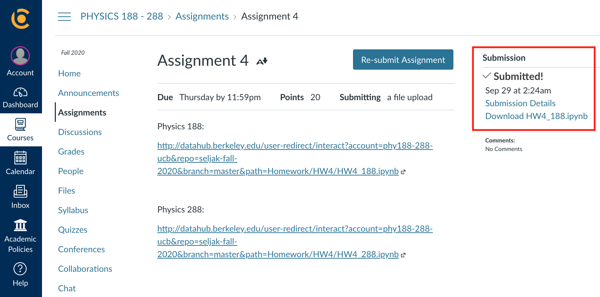

Homeworks 
=========

This page contains a list of links to PHY188/288 homeworks.

You can also access assignments from a link posted on the  bCourses website,  under “Assignments",
which contains the most updated information. 

Past Assignments
------------

 - **HW1 (Numerical Integration and ODE/PDEs)**: 
   &nbsp; &nbsp; [Physics 188](https://nbviewer.jupyter.org/github/phy188-288-ucb/seljak-fall-2019/blob/master/Homework/HW1/HW1_188.ipynb)/    [Physics 288](https://nbviewer.jupyter.org/github/phy188-288-ucb/seljak-fall-2019/blob/master/Homework/HW1/HW1_288.ipynb)
 - **HW2 (Intro to Statistics)**: 
   &nbsp; &nbsp; [Physics 188](https://nbviewer.jupyter.org/github/phy188-288-ucb/seljak-fall-2019/blob/master/Homework/HW2/HW2_188.ipynb)/    [Physics 288](https://nbviewer.jupyter.org/github/phy188-288-ucb/seljak-fall-2019/blob/master/Homework/HW2/HW2_288.ipynb)
 - **HW3 (Intro to Data Analysis, Dimensionality Reduction, and Clustering)**: 
   &nbsp; &nbsp; [Physics 188](https://nbviewer.jupyter.org/github/phy188-288-ucb/seljak-fall-2019/blob/master/Homework/HW3/HW3_188.ipynb)/    [Physics 288](https://nbviewer.jupyter.org/github/phy188-288-ucb/seljak-fall-2019/blob/master/Homework/HW3/HW3_288.ipynb)
 - **HW4 (Linear Algebra - Gaussian Elimination, SVD, Polynomial Regression, PCA, KNN, and Data Modeling)**: 
   &nbsp; &nbsp; [Physics 188](https://nbviewer.jupyter.org/github/phy188-288-ucb/seljak-fall-2019/blob/master/Homework/HW4/HW4_188.ipynb)/    [Physics 288](https://nbviewer.jupyter.org/github/phy188-288-ucb/seljak-fall-2019/blob/master/Homework/HW4/HW4_288.ipynb)
 - **HW5 (Fisher Information Matrix & Independent Component Analysis)**: 
   &nbsp; &nbsp; [Physics 188](https://nbviewer.jupyter.org/github/phy188-288-ucb/seljak-fall-2019/blob/master/Homework/HW5/HW5_188.ipynb)/    [Physics 288](https://nbviewer.jupyter.org/github/phy188-288-ucb/seljak-fall-2019/blob/master/Homework/HW5/HW5_288.ipynb)
 - **Project1-Part1 (Planck analysis I - Linear Algebra & Optimization)**: 
   &nbsp; &nbsp; [Physics 188](https://nbviewer.jupyter.org/github/phy188-288-ucb/seljak-fall-2019/blob/master/Homework/Project1_part1/Project1_part1_188.ipynb)/    [Physics 288](https://nbviewer.jupyter.org/github/phy188-288-ucb/seljak-fall-2019/blob/master/Homework/Project1_part1/Project1_part1_288.ipynb)
 - **Project1-Part2 (Planck analysis II - Bayesfast & Markov Chain Monte Carlo)**: 
   &nbsp; &nbsp; [Physics 188](https://nbviewer.jupyter.org/github/phy188-288-ucb/seljak-fall-2019/blob/master/Homework/Project1_part2/Project1_p2_188.ipynb)/    [Physics 288](https://nbviewer.jupyter.org/github/phy188-288-ucb/seljak-fall-2019/blob/master/Homework/Project1_part2/Project1_p2_288.ipynb)
 - **HW6 (Markov Chain Simulation and Hierarchical Model)**: 
   &nbsp; &nbsp; [Physics 188](https://nbviewer.jupyter.org/github/phy188-288-ucb/seljak-fall-2019/blob/master/Homework/HW6/HW6_188.ipynb)/    [Physics 288](https://nbviewer.jupyter.org/github/phy188-288-ucb/seljak-fall-2019/blob/master/Homework/HW6/HW6_288.ipynb)
 - **HW7 (Distributional Approximation, Expectation Maximization (EM), Interpolation and Resampling Methods)**: 
   &nbsp; &nbsp; [Physics 188](https://nbviewer.jupyter.org/github/phy188-288-ucb/seljak-fall-2019/blob/master/Homework/HW7/HW7_188.ipynb)/    [Physics 288](https://nbviewer.jupyter.org/github/phy188-288-ucb/seljak-fall-2019/blob/master/Homework/HW7/HW7_288.ipynb)
 - **HW8 part 1 (VI, EL2O, Generative Models, Multimodal Posteriors, and Gaussian Processes)**: 
   &nbsp; &nbsp; [Physics 188](https://nbviewer.jupyter.org/github/phy188-288-ucb/seljak-fall-2019/blob/master/Homework/HW8/notebooks/HW8_188.ipynb)/    [Physics 288](https://nbviewer.jupyter.org/github/phy188-288-ucb/seljak-fall-2019/blob/master/Homework/HW8/notebooks/HW8_288.ipynb)
 - **Project 2 (LIGO analysis - Fourier methods, Matched Filtering, and Differential Equations)**: 
   &nbsp; &nbsp; [Physics 188](https://nbviewer.jupyter.org/github/phy188-288-ucb/seljak-fall-2019/blob/master/Homework/Project2/Project2_188.ipynb)/    [Physics 288](https://nbviewer.jupyter.org/github/phy188-288-ucb/seljak-fall-2019/blob/master/Homework/Project2/Project2_288.ipynb)
 - **HW8 part 2 (Linear Regression, Regularization, and Logistic & Softmax Regression)**: 
   &nbsp; &nbsp; [Physics 188](https://nbviewer.jupyter.org/github/phy188-288-ucb/seljak-fall-2019/blob/master/Homework/HW8_p2/HW8_p2_188.ipynb)/    [Physics 288](https://nbviewer.jupyter.org/github/phy188-288-ucb/seljak-fall-2019/blob/master/Homework/HW8_p2/HW8_p2_288.ipynb)
 - **Project 3 (Final) (Classification and inference with machine learning)**: 
   &nbsp; &nbsp; [Physics 188](https://nbviewer.jupyter.org/github/phy188-288-ucb/seljak-fall-2019/blob/master/Homework/Project3/Project3_188.ipynb)/    [Physics 288](https://nbviewer.jupyter.org/github/phy188-288-ucb/seljak-fall-2019/blob/master/Homework/Project3/Project3_288.ipynb)

   

<!-- - **Python Tutorial**: 
  &nbsp; &nbsp; [Intro to Python](http://datahub.berkeley.edu/user-redirect/interact?account=phy188-288-ucb&repo=seljak-fall-2020&branch=master&path=Homework/PythonTutorial/IntrotoPython.ipynb) (source:  https://github.com/berkeley-physics/intro_python)

<!-- - **HW1 (Intro to Statistics)** (Due Sept. 09, 11:59pm): 
   &nbsp; &nbsp; [Physics 188](http://datahub.berkeley.edu/user-redirect/interact?account=phy188-288-ucb&repo=seljak-fall-2020&branch=master&path=Homework/HW1/HW1_188.ipynb)/    [Physics 288](http://datahub.berkeley.edu/user-redirect/interact?account=phy188-288-ucb&repo=seljak-fall-2020&branch=master&path=Homework/HW1/HW1_288.ipynb)/    [Solution](http://datahub.berkeley.edu/user-redirect/interact?account=phy188-288-ucb&repo=seljak-fall-2020&branch=master&path=Homework/HW1/HW1_solution.ipynb
)
 
<!-- - **HW2 (Intro to Data Analysis, Dimensionality Reduction, and Clustering):** (Due Sept. 16, 11:59pm): 
   &nbsp; &nbsp; [Physics 188](http://datahub.berkeley.edu/user-redirect/interact?account=phy188-288-ucb&repo=seljak-fall-2020&branch=master&path=Homework/HW2/HW2_188.ipynb)/    [Physics 288](http://datahub.berkeley.edu/user-redirect/interact?account=phy188-288-ucb&repo=seljak-fall-2020&branch=master&path=Homework/HW2/HW2_288.ipynb)/    [Solution](http://datahub.berkeley.edu/user-redirect/interact?account=phy188-288-ucb&repo=seljak-fall-2020&branch=master&path=Homework/HW2/HW2-solution.ipynb)
 
<!-- - **HW3 (Linear Algebra - Gaussian Elimination, SVD, Polynomial Regression, PCA, KNN, and Data Modeling)** (Due Sept. 23, 11:59pm): 
   &nbsp; &nbsp; [Physics 188](http://datahub.berkeley.edu/user-redirect/interact?account=phy188-288-ucb&repo=seljak-fall-2020&branch=master&path=Homework/HW3/HW3_188.ipynb)/    [Physics 288](http://datahub.berkeley.edu/user-redirect/interact?account=phy188-288-ucb&repo=seljak-fall-2020&branch=master&path=Homework/HW3/HW3_288.ipynb)/    [Solution](http://datahub.berkeley.edu/user-redirect/interact?account=phy188-288-ucb&repo=seljak-fall-2020&branch=master&path=Homework/HW3/HW3-solution.ipynb)
 
<!-- - **HW4 (Fisher Information Matrix & Independent Component Analysis)** (Due Sept. 30, 11:59pm): 
   &nbsp; &nbsp; [Physics 188](http://datahub.berkeley.edu/user-redirect/interact?account=phy188-288-ucb&repo=seljak-fall-2020&branch=master&path=Homework/HW4/HW4_188.ipynb)/    [Physics 288](http://datahub.berkeley.edu/user-redirect/interact?account=phy188-288-ucb&repo=seljak-fall-2020&branch=master&path=Homework/HW4/HW4_288.ipynb)/    [Solution](http://datahub.berkeley.edu/user-redirect/interact?account=phy188-288-ucb&repo=seljak-fall-2020&branch=master&path=Homework/HW4/HW4_solution.ipynb)

<!-- - **Project1-Part1 (Planck analysis - Linear Algebra & Optimization)** (Due Oct. 9, 11:59pm): 
   &nbsp; &nbsp; [Physics 188](http://datahub.berkeley.edu/user-redirect/interact?account=phy188-288-ucb&repo=seljak-fall-2020&branch=master&path=Homework/Project1_part1/Project1_part1_188.ipynb)/    [Physics 288](http://datahub.berkeley.edu/user-redirect/interact?account=phy188-288-ucb&repo=seljak-fall-2020&branch=master&path=Homework/Project1_part1/Project1_part1_288.ipynb)/    [Solution](http://datahub.berkeley.edu/user-redirect/interact?account=phy188-288-ucb&repo=seljak-fall-2020&branch=master&path=Homework/Project1_part1/Project1_p1_solution.ipynb)
 
<!--10/9/2020: Problem 2 in this project is now slightly modified. If you already started working on it, You should take your codes from the old link and re-run them in the new link. 

<!-- - **Project1-Part2 (Planck analysis II + Supernovae Project)** (Due Oct. 16, 11:59pm): 
   &nbsp; &nbsp; [NEW LINK - 188](http://datahub.berkeley.edu/user-redirect/interact?account=phy188-288-ucb&repo=seljak-fall-2020&branch=master&path=Homework/Project1_part2_revised/Project1_p2_188.ipynb)/    [NEW LINK - 288](http://datahub.berkeley.edu/user-redirect/interact?account=phy188-288-ucb&repo=seljak-fall-2020&branch=master&path=Homework/Project1_part2_revised/Project1_p2_288.ipynb)/    [Solution](http://datahub.berkeley.edu/user-redirect/interact?account=phy188-288-ucb&repo=seljak-fall-2020&branch=master&path=Homework/Project1_part2_revised/Project1_p2-solution.ipynb)
   &nbsp; &nbsp; [OLD LINK - 188](http://datahub.berkeley.edu/user-redirect/interact?account=phy188-288-ucb&repo=seljak-fall-2020&branch=master&path=Homework/Project1_part2/Project1_p2_188.ipynb)/    [OLD LINK - 288](http://datahub.berkeley.edu/user-redirect/interact?account=phy188-288-ucb&repo=seljak-fall-2020&branch=master&path=Homework/Project1_part2/Project1_p2_288.ipynb)
 
<!--Links to HW5 and all future assignments will be available only on bcourses (under "Assignments")
 
<!-- - HW1 (due Sept 4, 11:59pm): [Undergraduate_level](http://datahub.berkeley.edu/user-redirect/interact?account=phy151-ucb&repo=seljak-phy151-fall-2018&branch=master&path=Homework/HW1/HW1_U.ipynb)/    [Graduate_level](http://datahub.berkeley.edu/user-redirect/interact?account=phy151-ucb&repo=seljak-phy151-fall-2018&branch=master&path=Homework/HW1/HW1_G.ipynb)
 - HW2 (due Sept 10, 11:59pm): [Undergraduate_level](http://datahub.berkeley.edu/user-redirect/interact?account=phy151-ucb&repo=seljak-phy151-fall-2018&branch=master&path=Homework/HW2/HW2_U.ipynb)/    [Graduate_level](http://datahub.berkeley.edu/user-redirect/interact?account=phy151-ucb&repo=seljak-phy151-fall-2018&branch=master&path=Homework/HW2/HW2_G.ipynb) 
 - HW3 (due Sept 17, 11:59pm): [Undergraduate_level](http://datahub.berkeley.edu/user-redirect/interact?account=phy151-ucb&repo=seljak-phy151-fall-2018&branch=master&path=Homework/HW3/HW3_U.ipynb)/    [Graduate_level](http://datahub.berkeley.edu/user-redirect/interact?account=phy151-ucb&repo=seljak-phy151-fall-2018&branch=master&path=Homework/HW3/HW3_G.ipynb) 
 - HW4 (due Sept 26, 11:59pm): [Undergraduate_level](http://datahub.berkeley.edu/user-redirect/interact?account=phy151-ucb&repo=seljak-phy151-fall-2018&branch=master&path=Homework/HW4/HW4_U.ipynb)/    [Graduate_level](http://datahub.berkeley.edu/user-redirect/interact?account=phy151-ucb&repo=seljak-phy151-fall-2018&branch=master&path=Homework/HW4/HW4_G.ipynb) 
 - Project1-Part1 (due Oct 5, 11:59pm): [Undergraduate_level](http://datahub.berkeley.edu/user-redirect/interact?account=phy151-ucb&repo=seljak-phy151-fall-2018&branch=master&path=Homework/Project1_part1/Project1_p1_U.ipynb)/    [Graduate_level](http://datahub.berkeley.edu/user-redirect/interact?account=phy151-ucb&repo=seljak-phy151-fall-2018&branch=master&path=Homework/Project1_part1/Project1_p1_G.ipynb) 
 - Project1-Part2 (due Oct 12, 11:59pm): [Undergraduate_level](http://datahub.berkeley.edu/user-redirect/interact?account=phy151-ucb&repo=seljak-phy151-fall-2018&branch=master&path=Homework/Project1_part2/Project1_p2_U.ipynb)/    [Graduate_level](http://datahub.berkeley.edu/user-redirect/interact?account=phy151-ucb&repo=seljak-phy151-fall-2018&branch=master&path=Homework/Project1_part2/Project1_p2_G.ipynb) 
 - Project1-Part3 (due Oct 19, 11:59pm): [Undergraduate_level](http://datahub.berkeley.edu/user-redirect/interact?account=phy151-ucb&repo=seljak-phy151-fall-2018&branch=master&path=Homework/Project1_part3/Project1_p3_U.ipynb)/    [Graduate_level](http://datahub.berkeley.edu/user-redirect/interact?account=phy151-ucb&repo=seljak-phy151-fall-2018&branch=master&path=Homework/Project1_part3/Project1_p3_G.ipynb) 
 - HW5 (due Oct 26, 11:59pm): [Undergraduate_level](http://datahub.berkeley.edu/user-redirect/interact?account=phy151-ucb&repo=seljak-phy151-fall-2018&branch=master&path=Homework/HW5/HW5_U.ipynb)/    [Graduate_level](http://datahub.berkeley.edu/user-redirect/interact?account=phy151-ucb&repo=seljak-phy151-fall-2018&branch=master&path=Homework/HW5/HW5_G.ipynb) 
 - HW6 (due Nov 2, 11:59pm): [Undergraduate_level](http://datahub.berkeley.edu/user-redirect/interact?account=phy151-ucb&repo=seljak-phy151-fall-2018&branch=master&path=Homework/HW6/HW6_U.ipynb)/    [Graduate_level](http://datahub.berkeley.edu/user-redirect/interact?account=phy151-ucb&repo=seljak-phy151-fall-2018&branch=master&path=Homework/HW6/HW6_G.ipynb)
 - HW7 (due Nov 9, 11:59pm): [Undergraduate_level](http://datahub.berkeley.edu/user-redirect/interact?account=phy151-ucb&repo=seljak-phy151-fall-2018&branch=master&path=Homework/HW7/HW7_U.ipynb)/    [Graduate_level](http://datahub.berkeley.edu/user-redirect/interact?account=phy151-ucb&repo=seljak-phy151-fall-2018&branch=master&path=Homework/HW7/HW7_G.ipynb) 
 - Project2 (due Nov 26, 11:59pm): [Undergraduate_level](http://datahub.berkeley.edu/user-redirect/interact?account=phy151-ucb&repo=seljak-phy151-fall-2018&branch=master&path=Homework/Project2/Project2_U.ipynb)/    [Graduate_level](http://datahub.berkeley.edu/user-redirect/interact?account=phy151-ucb&repo=seljak-phy151-fall-2018&branch=master&path=Homework/Project2/Project2_G.ipynb) 
 - HW8 (due Dec 3, 11:59pm): [Undergraduate_level](http://datahub.berkeley.edu/user-redirect/interact?account=phy151-ucb&repo=seljak-phy151-fall-2018&branch=master&path=Homework/HW8/HW8_U.ipynb)/    [Graduate_level](http://datahub.berkeley.edu/user-redirect/interact?account=phy151-ucb&repo=seljak-phy151-fall-2018&branch=master&path=Homework/HW8/HW8_G.ipynb) 
 - Project3 (due Dec 14, 11:59pm): [Undergraduate_level](http://datahub.berkeley.edu/user-redirect/interact?account=phy151-ucb&repo=seljak-phy151-fall-2018&branch=master&path=Homework/Project3/Project3_U.ipynb)/    [Graduate_level](http://datahub.berkeley.edu/user-redirect/interact?account=phy151-ucb&repo=seljak-phy151-fall-2018&branch=master&path=Homework/Project3/Project3_G.ipynb) >
 
 
<!-- - [HW1 (due Sept 5)](http://datahub.berkeley.edu/user-redirect/interact?account=bccp&repo=seljak-phy151-fall-2017&branch=master&path=Homework/HW1/HW1.ipynb)/  [Solution](http://datahub.berkeley.edu/user-redirect/interact?account=bccp&repo=seljak-phy151-fall-2017&branch=master&path=Homework/HW1/HW1-solution.ipynb)
 - [HW2 (due Sept 11)](http://datahub.berkeley.edu/user-redirect/interact?account=bccp&repo=seljak-phy151-fall-2017&branch=master&path=Homework/HW2/HW2.ipynb)/  [Solution](http://datahub.berkeley.edu/user-redirect/interact?account=bccp&repo=seljak-phy151-fall-2017&branch=master&path=Homework/HW2/HW2-solution.ipynb)
 - [HW3 (due Sept 18)](http://datahub.berkeley.edu/user-redirect/interact?account=bccp&repo=seljak-phy151-fall-2017&branch=master&path=Homework/HW3/HW3.ipynb)/  [Solution](http://datahub.berkeley.edu/user-redirect/interact?account=bccp&repo=seljak-phy151-fall-2017&branch=master&path=Homework/HW3/HW3-solution.ipynb)
 - [HW4 (due Sept 25)](http://datahub.berkeley.edu/user-redirect/interact?account=bccp&repo=seljak-phy151-fall-2017&branch=master&path=Homework/HW4/HW4.ipynb)/  [Solution](http://datahub.berkeley.edu/user-redirect/interact?account=bccp&repo=seljak-phy151-fall-2017&branch=master&path=Homework/HW4/HW4-solution.ipynb)
 - [HW5 (due Oct 2)](http://datahub.berkeley.edu/user-redirect/interact?account=bccp&repo=seljak-phy151-fall-2017&branch=master&path=Homework/HW5/HW5.ipynb)/  [Solution](http://datahub.berkeley.edu/user-redirect/interact?account=bccp&repo=seljak-phy151-fall-2017&branch=master&path=Homework/HW5/HW5-solution.ipynb)
 - [Project1 (due Oct 20)](http://datahub.berkeley.edu/user-redirect/interact?account=bccp&repo=seljak-phy151-fall-2017&branch=master&path=Homework/Project1/Project1.ipynb)/  [Solution](http://datahub.berkeley.edu/user-redirect/interact?account=bccp&repo=seljak-phy151-fall-2017&branch=master&path=Homework/Project1/Project1-solution.ipynb)
 - [HW6 (due Nov 1)](http://datahub.berkeley.edu/user-redirect/interact?account=bccp&repo=seljak-phy151-fall-2017&branch=master&path=Homework/HW6/HW6.ipynb)/  [Solution](http://datahub.berkeley.edu/user-redirect/interact?account=bccp&repo=seljak-phy151-fall-2017&branch=master&path=Homework/HW6/HW6-solution.ipynb)
 - [HW7 (due Nov 8)](http://datahub.berkeley.edu/user-redirect/interact?account=bccp&repo=seljak-phy151-fall-2017&branch=master&path=Homework/HW7/HW7.ipynb)/  [Solution](http://datahub.berkeley.edu/user-redirect/interact?account=bccp&repo=seljak-phy151-fall-2017&branch=master&path=Homework/HW7/HW7-solution.ipynb)
 - [HW8 (due Nov 15)](http://datahub.berkeley.edu/user-redirect/interact?account=bccp&repo=seljak-phy151-fall-2017&branch=master&path=Homework/HW8/HW8.ipynb)/  [Solution](http://datahub.berkeley.edu/user-redirect/interact?account=bccp&repo=seljak-phy151-fall-2017&branch=master&path=Homework/HW8/HW8-solution.ipynb)
 - [Project2 (due Nov 29)](http://datahub.berkeley.edu/user-redirect/interact?account=bccp&repo=seljak-phy151-fall-2017&branch=master&path=Homework/Project2/Project2.ipynb)/  [Solution](http://datahub.berkeley.edu/user-redirect/interact?account=bccp&repo=seljak-phy151-fall-2017&branch=master&path=Homework/Project2/Project2-solution.ipynb)
 - [Project3 (due Dec 13)](http://datahub.berkeley.edu/user-redirect/interact?account=bccp&repo=seljak-phy151-fall-2017&branch=master&path=Homework/Project3/Project3.ipynb) -->
<!-- - ``TO BE POSTED`` -->
<!-- - [HW2 ??? ??, 2017](http://datahub.berkeley.edu/user-redirect/interact?account=bccp&repo=seljak-phy151-fall-2017&branch=master&path=Homework/HW2/HW2.ipynb) -->
<!-- - [HW3 ??? ??, 2017](http://datahub.berkeley.edu/user-redirect/interact?account=bccp&repo=seljak-phy151-fall-2017&branch=master&path=Homework/HW3/HW3.ipynb) -->
<!-- - [HW4 ??? ??, 2017](http://datahub.berkeley.edu/user-redirect/interact?account=bccp&repo=seljak-phy151-fall-2017&branch=master&path=Homework/HW4/HW4.ipynb) -->

Instructions
------------

For the remainder of the semester, you are going to be writing and running the homeworks remotely on Google Colaboratory.
The greatest advantage of using Colab is that it supports free GPU, and this will be particularly useful for future assignments.

First, make sure that you are logged in to your Google Drive account. 
Open https://colab.research.google.com, and you can go over the Colab introduction notebook. 

Go to your personal google drive and create a folder for this class. Important: **Name it as "P188_288"**

On bcourses (under "Assignments"), you will be given a link to a zip file containing Jupyter notebooks. Upzip it and upload the entire assignment folder to your Drive folder "P188_288". 

Next, find the assignment notebook (files ending in .ipynb) and double click on it. Open with Colab. 

**CAUTION: Make sure to save your work progress. Note that the Colab will disconnect if you are idle for a certain amount of time or if your total connection time exceeds the max allowed time. If that happens, any unsaved progress will be lost. Hence, please get in the habit of saving your code frequently (File -> Save).** 

Once you finish your homework, you are going to submit the following:

1. Jupyter notebook converted to a pdf file

2. Publicly accessible link to your notebook

First, download your notebook as a pdf file. (File > Print > Save as PDF) 
Important: **Before you download your notebook, make sure to display full outputs in Jupyter. Check if your pdf file displays both codes and outputs.**

To get a publicly accessible link, hit the Share button at the top right, then click "Get link." Make sure that your link is publicly available. (Click on "Anyone with the link") Copy link. 

Go to bcourses and click the corresponding assignment title. Next, click the **Submit Assignment** button.

Click the **Choose File** button to upload a notebook (pdf file) from your computer. 

Provide a link to your Colab notebook. 

click the **Submit Assignment** button, and make sure to view the confirmation of your submission.

   
   
<!-- Past Assignments:
To download a Jupyter notebook, right click the link and save it as an .ipynb file.

<!-- - **HW1** (Numerical Integration and ODE/PDEs): [PDF](https://raw.githubusercontent.com/phy188-288-ucb/seljak-fall-2019/master/Homework/HW1.pdf)/  [Jupyter notebook](https://raw.githubusercontent.com/phy188-288-ucb/seljak-fall-2019/master/Homework/HW1.ipynb)
 
<!-- - **HW2** (Intro to Statistics): [PDF](https://raw.githubusercontent.com/phy188-288-ucb/seljak-fall-2019/master/Homework/HW2.pdf)/  [Jupyter notebook](https://raw.githubusercontent.com/phy188-288-ucb/seljak-fall-2019/master/Homework/HW2.ipynb)
 
<!-- - **HW3** (Intro to Statistics - Part 2): [PDF](https://raw.githubusercontent.com/phy188-288-ucb/seljak-fall-2019/master/Homework/HW3.pdf)/  [Jupyter notebook](https://raw.githubusercontent.com/phy188-288-ucb/seljak-fall-2019/master/Homework/HW3.ipynb)

<!-- - **HW4** (Linear Algebra and Data Modeling): [PDF](https://raw.githubusercontent.com/phy188-288-ucb/seljak-fall-2019/master/Homework/HW4.pdf)/  [Jupyter notebook](https://raw.githubusercontent.com/phy188-288-ucb/seljak-fall-2019/master/Homework/HW4.ipynb)

<!-- - **HW5** (Markov Chain Simulation and Hierarchical Model): [PDF](https://raw.githubusercontent.com/phy188-288-ucb/seljak-fall-2019/master/Homework/HW5.pdf)/  [Jupyter notebook](https://raw.githubusercontent.com/phy188-288-ucb/seljak-fall-2019/master/Homework/HW5.ipynb)
 
<!-- - **Project 1 - part 1** (Fisher Information Matrix): [PDF](https://raw.githubusercontent.com/phy188-288-ucb/seljak-fall-2019/master/Homework/Project1_p1.pdf)/  [Jupyter notebook](https://raw.githubusercontent.com/phy188-288-ucb/seljak-fall-2019/master/Homework/Project1_p1.ipynb)
 
<!-- - **Project 1 - part 2** (Linear Algebra and Optimization): [PDF](https://raw.githubusercontent.com/phy188-288-ucb/seljak-fall-2019/master/Homework/Project1_p2.pdf)/  [Jupyter notebook](https://raw.githubusercontent.com/phy188-288-ucb/seljak-fall-2019/master/Homework/Project1_p2.ipynb)
 
<!-- - **Project 1 - part 1** (Markov chain Monte Carlo): [PDF](https://raw.githubusercontent.com/phy188-288-ucb/seljak-fall-2019/master/Homework/Project1_p3.pdf)/  [Jupyter notebook](https://raw.githubusercontent.com/phy188-288-ucb/seljak-fall-2019/master/Homework/Project1_p3.ipynb)
 
<!-- - **HW6** (MLE, MCMC, Interpolation, Expectation Maximization (EM), and Resampling Methods): [PDF](https://raw.githubusercontent.com/phy188-288-ucb/seljak-fall-2019/master/Homework/HW6.pdf)/  [Jupyter notebook](https://raw.githubusercontent.com/phy188-288-ucb/seljak-fall-2019/master/Homework/HW6.ipynb)
 
<!-- - **HW7** (Distributional Approximation and Gaussian Processes): [PDF](https://raw.githubusercontent.com/phy188-288-ucb/seljak-fall-2019/master/Homework/HW7.pdf)/  [Jupyter notebook](https://raw.githubusercontent.com/phy188-288-ucb/seljak-fall-2019/master/Homework/HW7.ipynb)
 
<!-- - **Project 2** (Fourier methods, Matched Filtering, and Differential Equations): [PDF](https://raw.githubusercontent.com/phy188-288-ucb/seljak-fall-2019/master/Homework/Project2.pdf)/  [Jupyter notebook](https://raw.githubusercontent.com/phy188-288-ucb/seljak-fall-2019/master/Homework/Project2.ipynb)
 
<!-- - **HW8** (Linear Regression, Regularization, and Logistic & Softmax Regression): [PDF](https://raw.githubusercontent.com/phy188-288-ucb/seljak-fall-2019/master/Homework/HW8.pdf)/  [Jupyter notebook](https://raw.githubusercontent.com/phy188-288-ucb/seljak-fall-2019/master/Homework/HW8.ipynb)

<!-- - **Project 3** (Classification and inference with machine learning): [PDF](https://raw.githubusercontent.com/phy188-288-ucb/seljak-fall-2019/master/Homework/Project3.pdf)/  [Jupyter notebook](https://raw.githubusercontent.com/phy188-288-ucb/seljak-fall-2019/master/Homework/Project3.ipynb)
